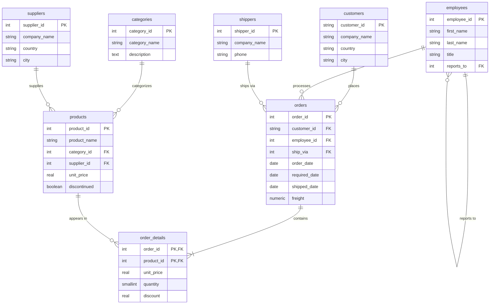
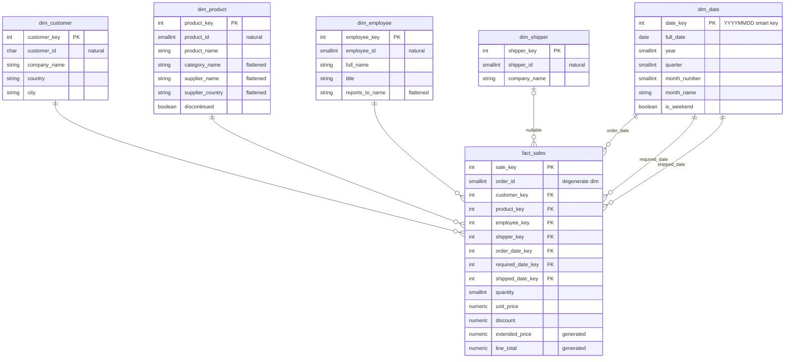
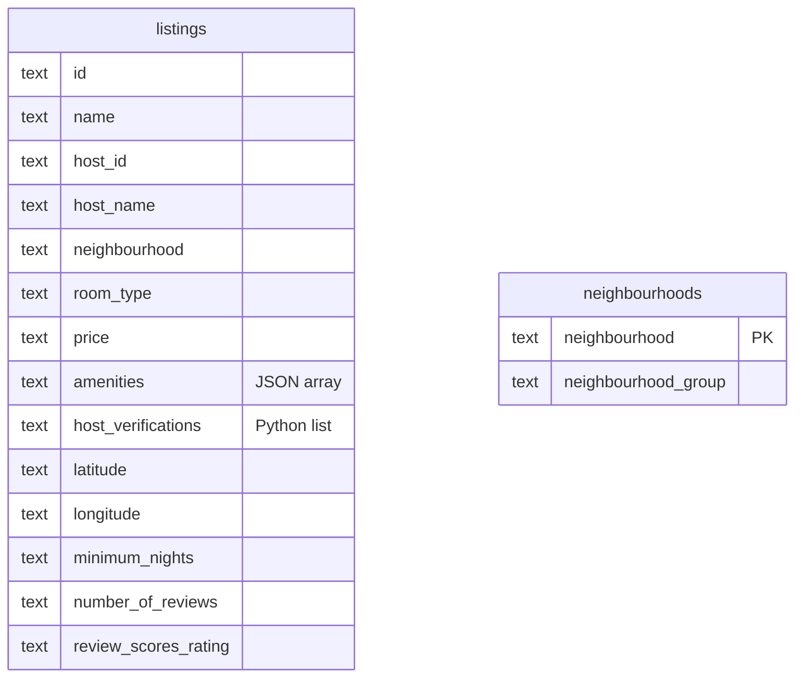

# Diagramas entidad-relación de los tres schemas

Visión rápida de la estructura de los tres schemas que viven en la base `northwind`. Los diagramas usan **Mermaid** y GitHub los renderiza directamente en el navegador — si tu visor local no soporta Mermaid, ve [esta versión en GitHub](https://github.com/OscarAlvarezC/diplomado-bi-unam-iimas/blob/main/anexos/diagramas_er.md) o usa [mermaid.live](https://mermaid.live) pegando el código.

---

## :package: `northwind_oltp` — sistema transaccional (3NF)

Datos originales de la empresa ficticia Northwind. 14 tablas normalizadas en 3NF. Cada hecho del negocio vive en una sola tabla; las relaciones se reconstituyen vía `JOIN`.



> **Tablas secundarias** que no aparecen en el diagrama por claridad: `region`, `territories`, `employee_territories`, `customer_demographics`, `customer_customer_demo`, `us_states`. Son tablas de catálogo auxiliar que prácticamente no se usan en queries analíticas.

### Patrones a notar

- **`order_details` tiene PK compuesta** `(order_id, product_id)` — una fila por cada producto en cada pedido (grano "por línea de pedido").
- **`employees.reports_to`** es self-FK que apunta al jefe del empleado — jerarquía de empleados en una sola tabla. El CEO (Andrew Fuller, `employee_id = 2`) tiene `reports_to = NULL`.
- **3NF estricta**: categorías y proveedores viven en tablas aparte, no como atributos de `products`. Para reportes "ventas por categoría" hay que cruzar 4 tablas.

---

## :star: `northwind_dwh` — data warehouse (esquema estrella)

Reorganización de los mismos datos para análisis. Una **tabla de hechos** (`fact_sales`) en el centro + **cinco dimensiones** alrededor. Sigue el patrón Kimball.



### Patrones Kimball aplicados

- **Surrogate keys** (`customer_key`, `product_key`, etc.) en todas las dims — desacoplan el DWH de los IDs del sistema fuente. La natural key (`customer_id`, `product_id`) queda como atributo descriptivo.
- **Smart key** en `dim_date`: `date_key` es `YYYYMMDD` como entero. Filtrable directo (`WHERE order_date_key BETWEEN 19970101 AND 19971231`) sin join.
- **Role-playing**: una sola `dim_date` con **tres FKs distintas** en `fact_sales` (order_date, required_date, shipped_date). Misma tabla, tres roles.
- **Degenerate dimension**: `order_id` vive en la fact sin tabla propia. Sirve para `COUNT(DISTINCT order_id)` por categoría/cliente/etc.
- **Aplanamiento (denormalización deliberada)**: `category_name` y `supplier_name` viven en `dim_product` como atributos, no en tablas aparte. Esto duplica strings pero elimina joins en queries analíticas.
- **Generated columns**: `extended_price` y `line_total` los calcula PostgreSQL automáticamente con `GENERATED ALWAYS AS … STORED`.
- **`shipper_key` nullable**: porque un pedido puede no haberse despachado todavía (lifecycle de atributos).

---

## :house: `airbnb` — datos semi-estructurados (bronze)

Snapshot mensual de Inside Airbnb para CDMX (septiembre 2025). Solo dos tablas, prácticamente sin estructura relacional — todo en formato "bronze" (TEXT crudo, fiel a la fuente).



> **No hay FK formal** entre `listings` y `neighbourhoods` en el bronze. La conexión es por nombre de texto (`listings.neighbourhood = neighbourhoods.neighbourhood`) pero sin constraint declarado — son datos crudos.

### Por qué bronze sin tipos ni constraints

- **Fidelidad al origen**: cargar los CSV de Inside Airbnb tal cual, sin pretender que la fuente sea limpia. Si un campo tiene `"N/A"` literal en lugar de `NULL`, lo guardamos así.
- **Sin PK en `listings`** porque hay `id`s que podrían tener problemas de unicidad en el origen — la carga no debe fallar por eso.
- **79 columnas TEXT**: el casting a tipos correctos (NUMERIC para precios, BOOLEAN, DATE) se hace en la capa "silver" del ETL, que está fuera del alcance del módulo.
- **`amenities` es un JSON array válido** — usable directo con `JSONB` en el Tema 10 (datos semi-estructurados).
- **`host_verifications` es lista Python** (con comillas simples) — necesita transformación a JSON antes de cargar a `JSONB`. Es ejemplo típico de "dato sucio que parece JSON pero no lo es".

### Mostradas solo algunas columnas

`listings` tiene **79 columnas** en total — el diagrama solo muestra las más relevantes para análisis. El resto incluye campos como descripciones HTML largas, fechas de scraping, URLs de imágenes, etc.

---

## :left_right_arrow: Relación entre los tres schemas

Los tres viven en la misma base `northwind` pero **son lógicamente independientes**:

- `northwind_oltp` y `northwind_dwh` representan los mismos datos en estructuras distintas — el DWH se popula desde el OLTP vía ETL (Temas 04 y 05). **Sin FKs entre schemas.**
- `airbnb` es completamente independiente — distinto dominio de datos. Convive en la misma base por conveniencia operativa.

Esto significa que puedes hacer joins **dentro de un schema** sin problema, pero joins **entre `northwind_oltp` y `northwind_dwh`** solo tienen sentido para validar el ETL (cross-check de totales OLTP vs DWH), no para análisis productivo.

---

## :hammer_and_wrench: Generar tus propios diagramas

Si quieres exportar estos diagramas como PNG/SVG para ponerlos en una presentación o reporte:

1. Copia el código Mermaid del bloque que te interese.
2. Pégalo en [mermaid.live](https://mermaid.live).
3. **Actions → PNG / SVG / Markdown** según el formato que necesites.

Alternativa con `mermaid-cli` desde terminal:

```bash
npm install -g @mermaid-js/mermaid-cli
mmdc -i diagrama.mmd -o diagrama.png
```

DBeaver también puede generar diagramas ER directamente (click derecho sobre el schema → **View Diagram**) sin escribir Mermaid — útil para schemas que no están en este documento.

---

<p align="center">
<a href="../README.md">← Volver al inicio</a> | <a href="README.md">Volver a anexos</a>
</p>
