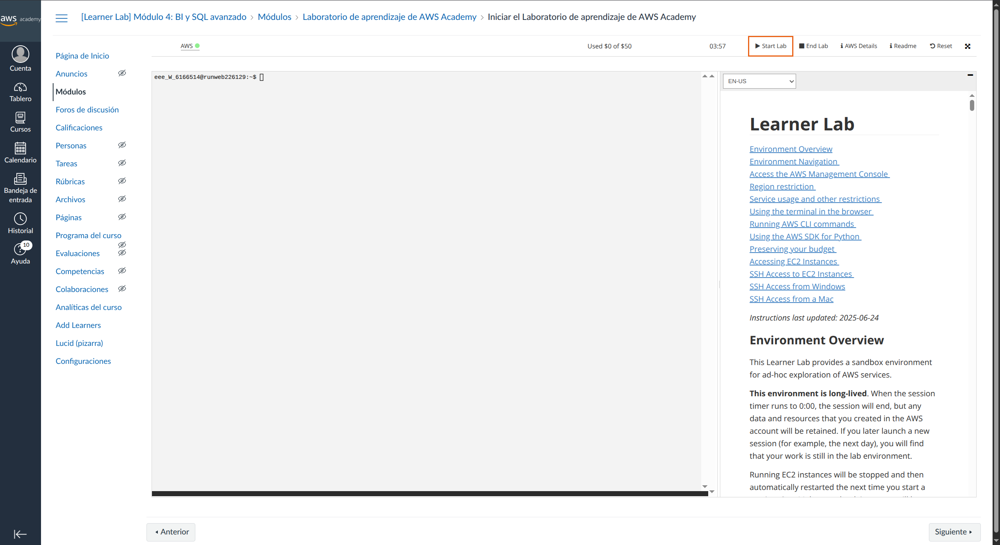
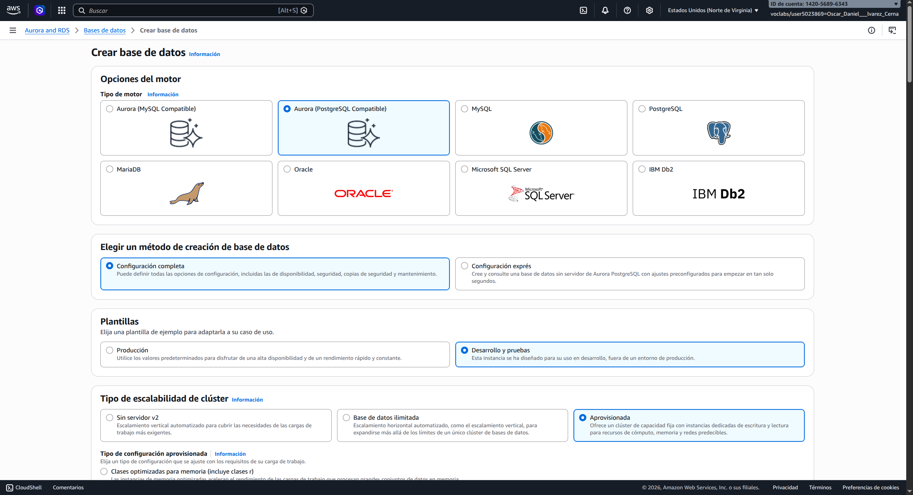
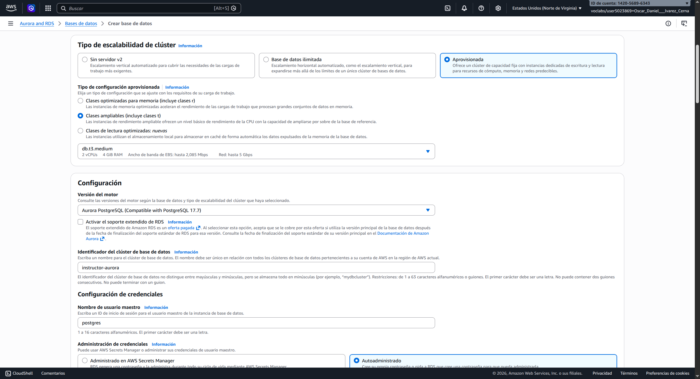
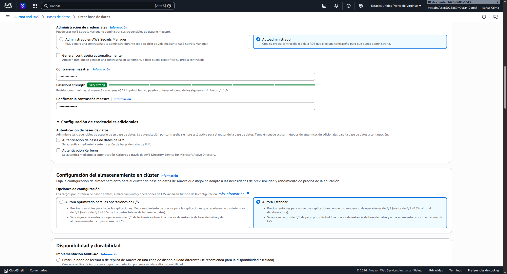
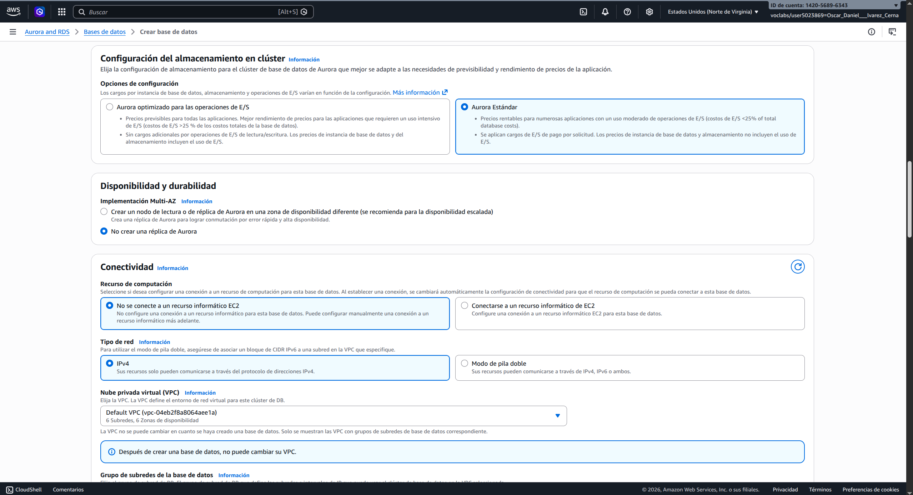
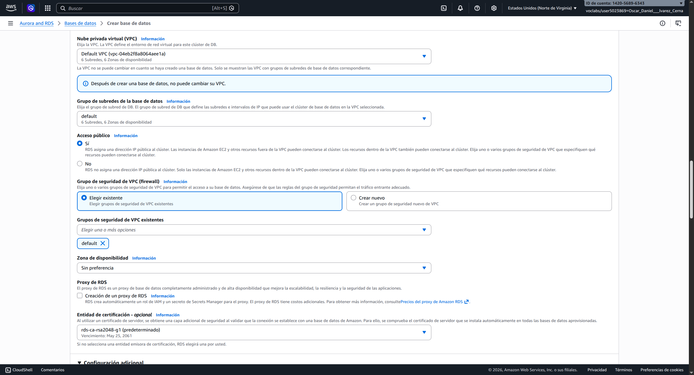
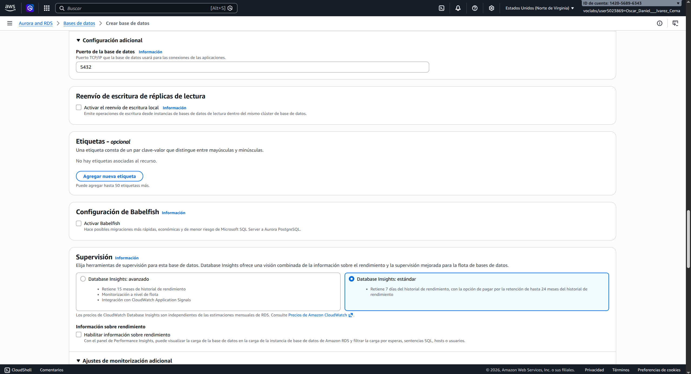
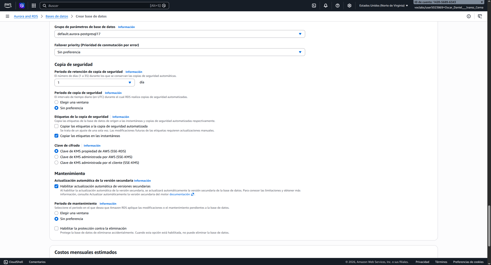

# 01 — Crear tu cluster Aurora PostgreSQL en el Learner Lab

Esta es la primera guía del setup. Al terminarla tendrás un servidor PostgreSQL corriendo en la nube de AWS, listo para conectar desde tu laptop con DBeaver.


## Prerequisitos

- Cuenta de **AWS Academy Learner Lab** activa.
- Conexión a internet estable.

---

## Paso 1 — Iniciar tu Learner Lab y abrir la consola AWS

1. Entra a `https://awsacademy.instructure.com` con tu cuenta de estudiante.
2. Abre el curso del diplomado.
3. Localiza el módulo de tu **AWS Academy Learner Lab** (suele aparecer como tarjeta o módulo en el dashboard del curso). Este lo podrás localizar con el nombre **[Learner Lab] Módulo 4: BI y SQL avanzado**.
4. Te diriges a Módulos > Iniciar el Laboratorio de aprendizaje de AWS Academy.
5. Click en **Start Lab**. El indicador en la esquina izquierda pasará a verde en ~1-2 minutos.
6. Una vez verde, click en **AWS** (logo a la izquierda del indicador verde). Se abrirá la consola de AWS en una pestaña nueva, ya autenticado.



> ⚠️ **No cierres la pestaña de Learner Lab.** Si la cierras, AWS termina la sesión y pierdes acceso a la consola hasta volver a hacer Start Lab. Cada Start Lab consume parte de tus 4 horas máximas continuas.

**Verifica:** la consola debe abrir en la región **us-east-1 (N. Virginia)**. Esquina superior derecha — confirma que dice "N. Virginia". Si no, **cámbiala** desde el dropdown.

---

## Paso 2 — Crear el cluster Aurora PostgreSQL

### 2.1 — Navegar al servicio RDS

En la barra de búsqueda superior de la consola AWS, escribe **RDS** y selecciónalo. Una vez en RDS:

- Sidebar izquierdo → **Bases de datos**.
- Botón naranja arriba a la derecha → **Crear base de datos**.

### 2.2 — Configuración del cluster

Llena el formulario con estos valores. Los que **no menciono explícitamente** déjalos en su valor default.



#### Método de creación

- **Configuración completa** (NO Configuración rápida).

#### Opciones del motor

| Campo | Valor |
|---|---|
| Tipo de motor | **Aurora (compatible con PostgreSQL)** |
| Versión del motor | **Aurora PostgreSQL 17.7** (la más reciente que aparezca) |

#### Plantillas

- **Desarrollo y prueba**.

#### Tipo de escalabilidad de clúster

- **Aprovisionado**.

#### Configuración

| Campo | Valor |
|---|---|
| Identificador del clúster de base de datos | `aurora-mod4` (o el nombre que prefieras, todo en minúsculas y con guiones, sin espacios) |
| Nombre de usuario maestro | `postgres` |
| Administración de credenciales | **Autoadministrado** |
| Contraseña maestra | Genera una contraseña fuerte y **guárdala** ya en tu gestor de contraseñas — la necesitarás cada vez que conectes. Sugerencia: usa `openssl rand -base64 24` en una terminal para generar una buena |
| Confirmar contraseña | (la misma) |



> ℹ️ La captura muestra `instructor-aurora` porque es del cluster del instructor. Tú usa **`aurora-mod4`** como identificador (o el nombre que prefieras).

#### Configuración de instancia

| Campo | Valor |
|---|---|
| Clase de instancia | **db.t3.medium** |

#### Disponibilidad

- **No crear una réplica de Aurora.** (El Learner Lab no soporta multi-AZ; intentar agregar réplica falla.)



#### Conectividad

| Campo | Valor |
|---|---|
| Recurso de cómputo | **No conectarse a un recurso de cómputo de EC2** |
| Tipo de red | **IPv4** |
| Nube virtual privada (VPC) | **VPC predeterminada** |
| Grupo de subredes de base de datos | default |
| **Acceso público** | **Sí** ⚠️ esto es **crítico** — sin esto no podrás conectar desde DBeaver de tu laptop |
| Grupo de seguridad de VPC | **default** (el que ya existe) |
| Zona de disponibilidad | Sin preferencia |
| Proxy de RDS | desmarcado |
| Entidad de certificación | `rds-ca-rsa2048-g1` (predeterminada) |





> ⚠️ **Acceso público** debe estar marcado. Si lo dejas en No, tu cluster queda solo accesible desde dentro de la VPC de AWS — y desde tu laptop no podrás llegar. Lo arreglas después editando el cluster, pero es más fácil ponerlo bien ahora.

#### Autenticación de base de datos

- **Autenticación por contraseña** marcado (predeterminado). NO marques IAM ni Kerberos.

#### Supervisión

- **Database Insights:** Estándar (predeterminado).
- **Performance Insights:** desactivado.
- **Monitorización mejorada:** desactivado (no soportado en Learner Lab).



#### Configuración adicional

| Campo | Valor |
|---|---|
| Nombre de base de datos inicial | `northwind` |
| Grupo de parámetros del clúster de base de datos | default (default.aurora-postgresql17) |
| Grupo de parámetros de base de datos | default |
| Prioridad de conmutación por error | Sin preferencia |
| Periodo de retención de copia de seguridad | 1 día |
| Ventana de copia de seguridad | Sin preferencia |
| Cifrado | habilitado (predeterminado), clave propiedad de AWS |
| Actualización automática de versiones secundarias | habilitada |
| Ventana de mantenimiento | Sin preferencia |
| Habilitar la protección contra la eliminación | **desactivado** (importante para poder eliminar el cluster sin trámite) |




### 2.3 — Crear

Click en **Crear base de datos** abajo a la derecha. AWS empieza a aprovisionar el cluster.

> 💰 **AWS te muestra una estimación de costo** antes de confirmar. Para `db.t3.medium` debe estar alrededor de $0.082/hora. Confirma que la estimación es razonable antes de seguir.

---

## Paso 3 — Esperar a que el cluster esté Disponible

Vuelve a **RDS → Bases de datos**. Verás dos elementos relacionados:

```
aurora-mod4              (el cluster — capa de almacenamiento)
aurora-mod4-instance-1   (la instancia — capa de cómputo)
```

Ambos pasarán por estos estados:
- `Creando` → `Realizando copia de seguridad` → `Disponible` ✅

**Tarda 5-10 minutos.** 

Cuando ambos digan `Disponible`, el cluster está listo.

### Anotar el endpoint

Click en el cluster (`aurora-mod4`). En la pestaña **Conectividad y seguridad > Puntos de conexión** verás:

```
Endpoint (lector):  aurora-mod4.cluster-XXXXXXXX.us-east-1.rds.amazonaws.com
Port:      5432
```

**Cópialo y guárdalo** junto con tu password — los necesitarás en la siguiente guía cuando configures DBeaver.

---

## Paso 4 — Verificación rápida

Antes de cerrar esta guía, confirma que todo está bien:

| Check | Cómo verificar |
|---|---|
| ✅ Cluster `Disponible` | RDS → Bases de datos — estado verde |
| ✅ Endpoint anotado | Lo guardaste junto con el password |
| ✅ Acceso público habilitado | Click en la instancia `aurora-mod4-instance-1` → pestaña **Conectividad y seguridad** → sección **Puntos de conexión** → **Seguridad** → "Accesible públicamente: Sí" |
| ✅ DB inicial `northwind` creada | Pestaña **Configuración** → "Nombre de base de datos inicial: northwind" |
| ✅ Tu password lo tienes guardado | Password manager o nota local segura |

---

## Operativa importante

### 🔴 Pausar el cluster al terminar cada sesión

Tu crédito del Learner Lab es limitado. Mientras el cluster esté `Disponible`, **gasta**.

Al terminar de trabajar:

1. RDS → Bases de datos → click en tu cluster.
2. **Acciones** → **Detener temporalmente**.
3. Confirma. El cluster pasa a `Detenido`.

> ℹ️ AWS **auto-reanuda** el cluster a los 7 días aunque sigas con Stop. Si trabajas con varios días de pausa, necesitas volver a hacer Stop. El propósito de auto-resume es que la BD no se quede dormida indefinidamente y los datos se compacten / mantengan.

### 🟢 Reanudar para la siguiente sesión

1. RDS → Bases de datos → cluster.
2. **Acciones** → **Iniciar**.
3. Espera 3-5 minutos hasta que diga `Disponible`.

### Costos aproximados

| Tiempo encendido | Costo |
|---|---|
| 1 hora | ~$0.08 USD |
| 1 día completo (24h) | ~$2 USD |
| 1 semana ininterrumpida | ~$13 USD |
| 1 mes ininterrumpido | ~$58 USD |

El crédito de Learner Lab es de $50 USD, así que olvidar pausar **una noche o un fin de semana** no es desastre. Olvidarlo **una semana o más** sí empieza a doler.

---

## Errores comunes

### "Cannot create db.serverless"

Estás eligiendo Aurora Serverless v2. **Pivota a Aprovisionado** (Tipo de escalabilidad de clúster → Aprovisionado).

### "User is not authorized to perform: rds:CreateDBInstance"

Probablemente elegiste una clase de instancia más grande que `medium`. El Learner Lab solo permite hasta `db.t3.medium`. Vuelve y selecciona esa clase.

### "Database creation failed"

Causas comunes:
- La contraseña maestra no cumple los requisitos (mínimo 8 caracteres, sin caracteres prohibidos como `/`, `"`, `@`, espacio).
- Identifier del cluster ya existe en tu cuenta — usa otro nombre.
- DB inicial name con caracteres no permitidos — usa solo letras, números, underscore.

### El cluster nunca pasa de `Creando`

Después de 15 minutos sin progreso, lo más práctico es **eliminarlo y crearlo de nuevo**. Click → Acciones → Eliminar → desmarca "crear instantánea final" → confirma. Después vuelves al Paso 2.

### No veo la opción de "Acceso público"

Estás en la sección equivocada del formulario. Está dentro de **Conectividad** → expande la sección si está colapsada.

---

## Siguiente paso

Continúa con **`02_dbeaver_conexion.md`** — vas a instalar DBeaver Community en tu laptop, configurar el security group del cluster para permitir conexiones desde tu IP, y conectar al servidor que acabas de crear.

---

[← Volver al índice de la sesión 1](../Sesion-01/Readme.md) | [Siguiente: 02 — DBeaver →](02_dbeaver_conexion.md)
